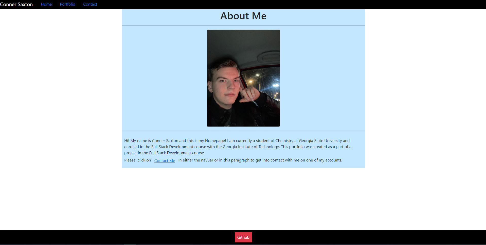

  # React-Portfolio-Hobbyist

  

    

  <!-- Titled description for grading clarity. Will remove after grading -->
  ## Description
  This was a project in the Georgia Tech Bootcamp program. It is meant to e a functional react portfolio website, with dynamic rendering and react technology. This app is not meant to be viewed in a professional sense, and should be seen more as a hobbyist app. I would like to incorporate a background image between the header and the footer, but nothing I do will take a section to the footer and directly stop it there, for whatever reason. Also, I cannot get the image url linked properly and rendered dynamically in the portfolio page, and I have tried everything I can think of to get it working, but all only one project card component is used multiple times on the portfolio page and different info is generated on each card.
   

  

  
  
  ## Table of Contents
  1. [Description](#description)
  2. [Installation](#installation)
  3. [Usage](#usage)
  4. [License](#license)
  5. [ContactMe](#contactme)
  

  ## Installation
  No installation required.
   

  ## Usage
  To use this app, simply follow the link here: https://rstadev.github.io/react-port/#/
   

  ## License
  Link at: https://opensource.org/licenses/MIT
   
  License information: Copyright 2021 

    Permission is hereby granted, free of charge, to any person obtaining a copy of this software and associated documentation files (the "Software"), to deal in the Software without restriction, including without limitation the rights to use, copy, modify, merge, publish, distribute, sublicense, and/or sell copies of the Software, and to permit persons to whom the Software is furnished to do so, subject to the following conditions:
    
    The above copyright notice and this permission notice shall be included in all copies or substantial portions of the Software.
    
    THE SOFTWARE IS PROVIDED "AS IS", WITHOUT WARRANTY OF ANY KIND, EXPRESS OR IMPLIED, INCLUDING BUT NOT LIMITED TO THE WARRANTIES OF MERCHANTABILITY, FITNESS FOR A PARTICULAR PURPOSE AND NONINFRINGEMENT. IN NO EVENT SHALL THE AUTHORS OR COPYRIGHT HOLDERS BE LIABLE FOR ANY CLAIM, DAMAGES OR OTHER LIABILITY, WHETHER IN AN ACTION OF CONTRACT, TORT OR OTHERWISE, ARISING FROM, OUT OF OR IN CONNECTION WITH THE SOFTWARE OR THE USE OR OTHER DEALINGS IN THE SOFTWARE.
    
    

  ## ContactMe
  Message me on Github at https://github.com/rstadev
   
  or email me at
   
   

